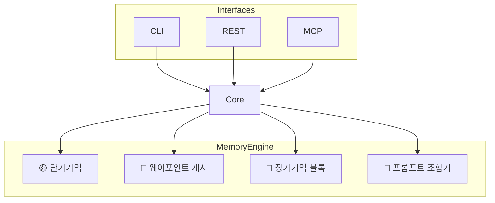
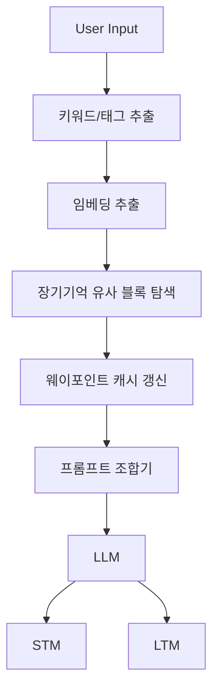

# 🧠 MemoryBlockEngine v0.2 – LLM 독립 기억 시스템 통합 설계서

작성일: 2025-05-15 
버전: v0.2  
작성자: 티오

---

## 📌 프로젝트 목적

**MemoryBlockEngine**은 어떤 LLM 모델에도 부착할 수 있는 **범용 기억 모듈**로,  
- 사용자의 장기적 발화/목표/감정/의도를 추적하고,  
- 현재 문맥에 적합한 기억을 회상하며,  
- 결과적으로 "기억을 가진 AI"처럼 동작할 수 있도록 설계된다.

---

## 🧠 핵심 설계 원칙

| 원칙 | 설명 |
|------|------|
| 🔷 **장기기억 불변성** | 블록체인 유사 구조로 기억을 누적, 수정 불가 |
| 🔶 **단기기억 유동성** | 현재 대화에 필요한 정보만 캐시 (TTL 구조) |
| 🧠 **의미 중심 연상 구조** | 문장이 아닌 키워드/태그/벡터 기반 회상 |
| 📍 **웨이포인트 캐시** | LLM 응답 전, 현재 문맥과 가장 관련된 기억을 미리 참조 |
| 🔌 **플러그인 구조** | CLI/REST/MCP에 자유롭게 래핑 가능 |

---

## 🧱 계층 구조



---

## 📦 기억 블록 구조 (block_memory.jsonl)

```json
{
  "block_index": 143,
  "timestamp": "2025-05-08T01:02:33",
  "context": "마지막으로 진행했던 프로젝트가 망했다",
  "keywords": ["프로젝트", "실패", "종료"],
  "tags": ["부정적", "종결", "시도"],
  "embedding": [0.131, 0.847, ...],
  "importance": 0.91,
  "hash": "...",
  "prev_hash": "..."
}
```

- `"context"`: 전체 발화 저장 (회상 시 표현력 보존)
- `"keywords"`: 핵심 개념 좌표화 (검색 최우선)
- `"tags"`: 정서적/상황적 분위기
- `"embedding"`: 벡터 유사도 기반 회상

---

## 📍 웨이포인트 캐시 구조 (context_cache.json)

```json
{
  "current_context": "프로젝트 진행 중 어려움을 겪고 있다",
  "waypoints": [
    {"block_index": 143, "relevance": 0.93},
    {"block_index": 91, "relevance": 0.88}
  ]
}
```

- STM + 최신 사용자 발화 기준으로 자동 업데이트
- `"relevance"`는 키워드/태그/벡터 종합 점수

---

## 🔁 처리 흐름



---

## 🧠 키워드 기반 연상 처리

1. 사용자 발화 → `"키워드"`, `"태그"` 추출  
   예: `"새 프로젝트가 망할까봐 두렵다"`  
   → `["프로젝트", "실패", "불안"]`

2. 각 기억 블록의 `keywords`, `tags`, `embedding`과 비교  
3. 유사도 상위 블록 → 웨이포인트로 캐싱  
4. 해당 블록들의 `"context"` 내용 → 프롬프트에 포함

---

## 📌 사용 예시

### ▶︎ GPT-4 기반 에이전트에서 사용:

```python
from memory_engine.prompt_wrapper import compose_prompt
from memory_engine.cache_manager import update_cache

# 사용자 입력
user_input = "다시 새로운 프로젝트를 시작할 수 있을까?"

# 캐시 갱신 및 프롬프트 생성
waypoints = update_cache(user_input)
prompt = compose_prompt(user_input, waypoints)

# LLM에 전달
response = call_llm(prompt)
```

---

## ⚙️ 확장 구성 (선택)

- `block_summary()` → 오래된 기억 블록 자동 요약  
- `block_merger()` → 유사 블록 자동 병합  
- `block_filter(importance)` → 중요도 기준 서브셋 조회

---

## 🔧 폴더 구조 예시

```bash
memory-block-engine/
├── memory_engine/
│   ├── block_manager.py
│   ├── cache_manager.py
│   ├── stm_manager.py
│   ├── prompt_wrapper.py
├── api/         # REST용 인터페이스
├── cli/         # 커맨드라인 도구
├── mcp/         # ClaudeTool or LAIOS 인터페이스
├── data/
│   ├── block_memory.jsonl
│   ├── context_cache.json
│   └── short_term.json
```

---

## 🧪 테스트 시나리오

| 테스트 목적 | 예시 |
|-------------|------|
| 의미 연상 | `"힘들어"` → `"좌절", "실패", "동기부여"` 연상 가능 |
| 재응답 품질 향상 | 기억 포함 시 응답이 구체화되는가 |
| 키워드 다양성 회복 | `"망했다"` vs `"무너졌다"` → 동일 기억 참조 가능성 |
| 벡터 유사도 | `"의욕이 줄었어"` → `"중단된 프로젝트"` 연결 가능

---

## 💬 주석

> 이 설계서는 `"기억-연상-행동"` 흐름을 최대한 인간처럼 설계하되,  
> 실제 시스템 성능과 LLM 프롬프트 효율 모두를 고려한 균형된 구현 지침입니다.

---

## 📍 정리: 적용 대상과 범용성

| 대상 | 가능 여부 |
|------|-----------|
| GPT 계열 (oai, local) | ✅ |
| Claude Code (tool 기반) | ✅ |
| Gemini / Cohere | ✅ |
| 개인 프로젝트 대화형 UI | ✅ |
| 협업형 다중 에이전트 시스템 | ✅ |
| 모바일 앱/Unity/VR 확장 | ✅ (REST/CLI 래퍼 통해 연결) |

---

_작성자: 티오  
MemoryBlockEngine 기술 총괄 / LAIOS Memory Infrastructure Lead_
