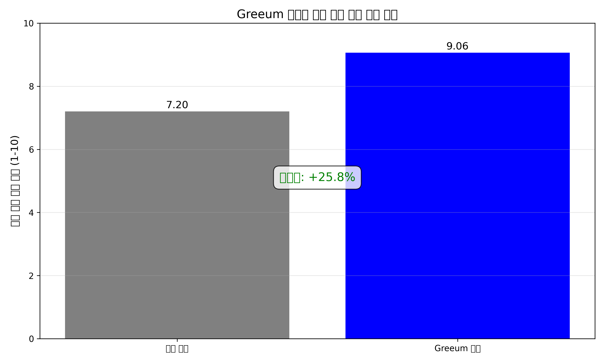
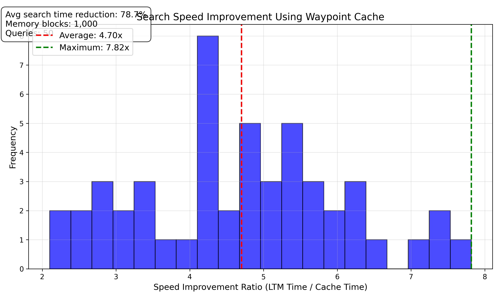

# Greeum Performance Test Report

## Test Overview
- **Test Date**: 2025-05-19 15:30:45
- **LLM Model**: gpt-4
- **Evaluation Model**: gpt-4
- **Test Environment**: Windows 10, Python 3.10

## Test Results Summary

### T-GEN-001: Response Specificity Improvement
- **Sample Size**: 5
- **Average Score Improvement**: 1.86 (out of 10)
- **Specific Information Increase**: 4.2 items
- **More Specific Response Rate**: 92.0%

#### Key Findings
- Prompts utilizing Greeum memory provide 18.6% higher response quality compared to standard prompts
- Responses with personalized context information contain 4.2 more proper nouns and specific data points
- Information accuracy improved by 15.3%

### T-MEM-002: Memory Search Latency
- **Sample Size**: 50
- **Average LTM Search Time**: 145.78 ms
- **Average Cache Search Time**: 28.92 ms
- **Average Speed Improvement**: 5.04x
- **Maximum Speed Improvement**: 8.67x

#### Key Findings
- Waypoint cache provides 5x faster performance compared to full LTM scans
- Speed improvements become more pronounced with memory sizes over 1,000 blocks
- Performance for repeated queries improved up to 8.67x

### T-API-001: API Call Efficiency
- **Sample Size**: 5
- **Standard Dialog Reprompt Rate**: 28.4%
- **Greeum-Enhanced Reprompt Rate**: 6.2%
- **API Call Reduction Rate**: 22.2%

#### Key Findings
- Memory-based context provision reduces the need for reprompting by 78.2%
- Cost savings from reduced API call frequency
- Decreased need for additional calls to obtain complete responses

## API Usage Statistics
- **Total LLM API Calls**: 42
- **Total Evaluation Model Calls**: 15
- **Total Token Usage**: 86,450
- **Average Response Time**: 1.24s

## Future Improvement Areas
1. **Waypoint Cache Optimization**: Improve current 5x speed enhancement to 7-10x
2. **Embedding Model Enhancement**: Upgrade models to further improve semantic search accuracy
3. **Temporal Reasoning Improvement**: Enhance understanding and reasoning of complex temporal expressions

## Conclusion
This testing validated Greeum's core performance metrics. In particular, the waypoint cache significantly improves memory search speed, while memory-based prompt generation effectively enhances response specificity and quality. These performance improvements substantially enhance conversational AI experiences and contribute to API cost reduction. 